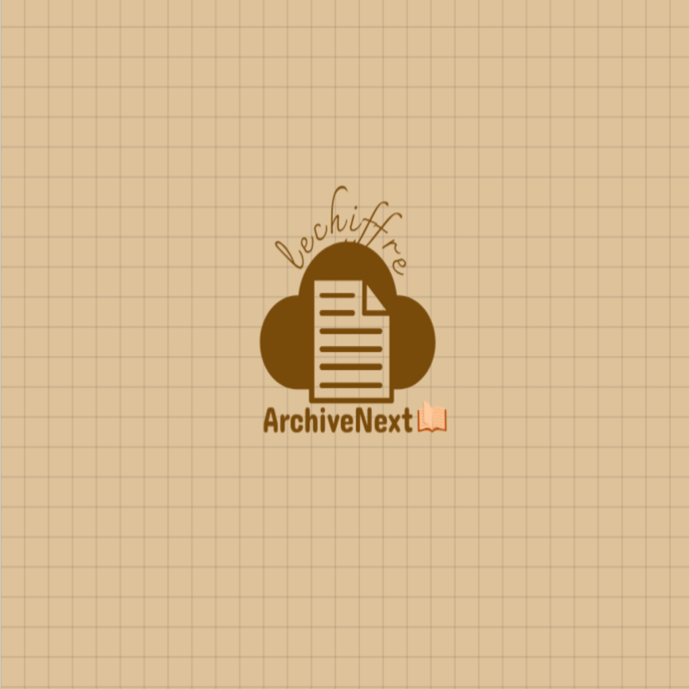
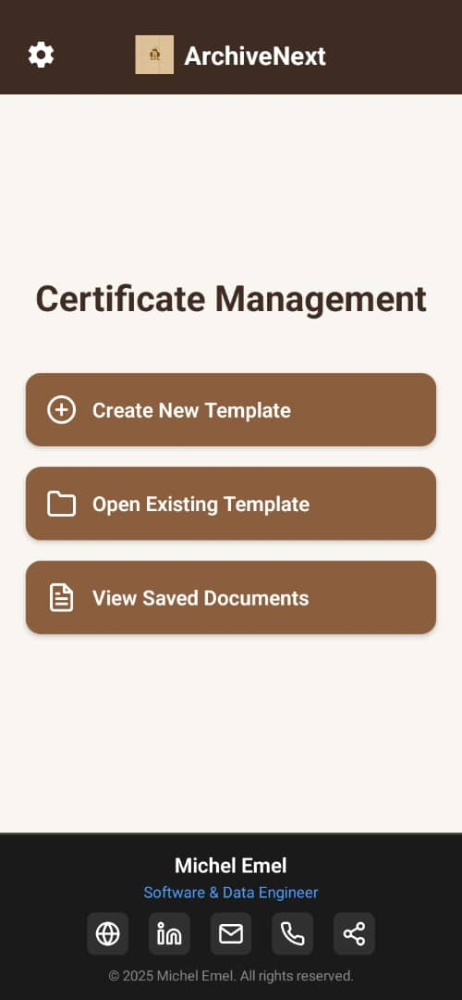
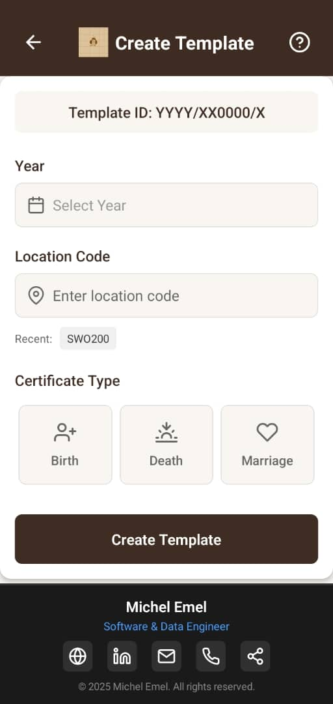
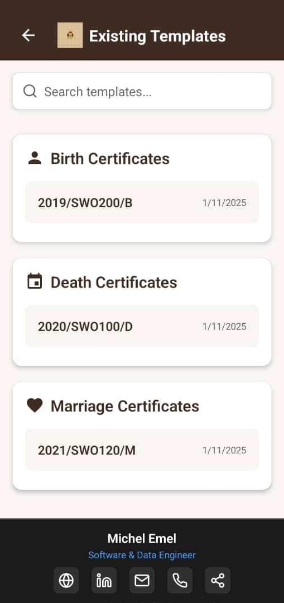
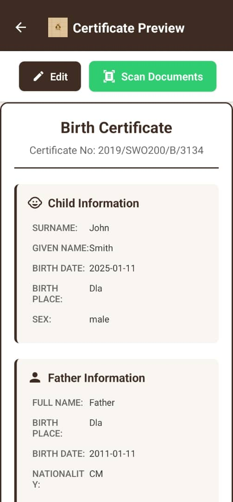
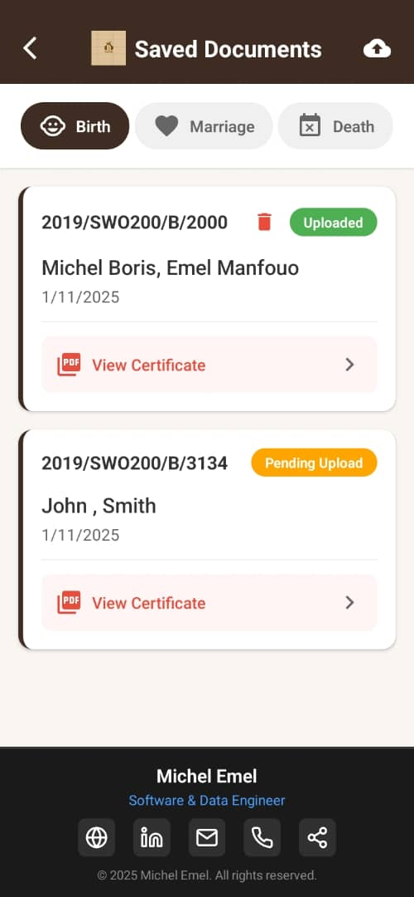
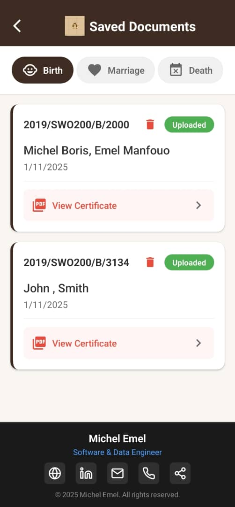

# ArchiveNext
## Smart Document Digitization Solution

  

## Table of Contents
- [Product Demo](#product-demo)
- [Key Benefits](#key-benefits)
- [Core Features](#core-features)
  - [Document Templates](#1-intelligent-document-templates)
  - [Document Scanning](#2-advanced-document-scanning)
  - [Document Management](#3-document-management)
- [User Interface & Workflow](#user-interface--workflow)
  - [Key Screens](#key-screens-and-features)
  - [Document Management](#5-intelligent-document-management)
  - [UI Benefits](#key-ui-benefits)
- [Security and Privacy](#security-and-privacy)
- [Support and Training](#support-and-training)
- [Product Roadmap](#product-roadmap)
- [Success Metrics](#success-metrics)
- [Contact Information](#contact-information)

---

## Product Demo
Watch our short demonstration video to see ArchiveNext in action:

  <video width="250" controls>
    <source src="archive_next.mp4" type="video/mp4">
    Your browser does not support the video tag.
  </video>

*This video demonstrates:*
- Document scanning process
- Template creation and management
- Cloud synchronization
- Real-time document processing
- User interface navigation

ArchiveNext is a mobile application that transforms how organizations handle document digitization and management. Powered by Google's ML Kit technology, it offers an intelligent, efficient solution for converting physical documents into digital formats.

## Key Benefits

<table>
<tr>
<td width="33%" align="center">
    <h3>🚀 Fast Processing</h3>
    
<strong>Streamlined Document Processing</strong>: Convert physical documents to digital formats in seconds

</td>
<td width="33%" align="center">
    <h3>📑 Smart Templates</h3>
    
<strong>Template Management</strong>: Create and manage templates for common document types

</td>
<td width="33%" align="center">
    <h3>🔒 Secure Storage</h3>
    
<strong>Enhanced Security</strong>: Local storage with cloud sync capabilities

</td>
</tr>
</table>

## Core Features

<table>
<tr>
<td width="33%" align="center">
    <h3>📝 Intelligent Document Templates</h3>
    <ul>
        <li><strong>Pre-built Templates:</strong>
            <ul>
                <li>Birth certificates</li>
                <li>Death certificates</li>
                <li>Marriage certificates</li>
            </ul>
        </li>
        <li><strong>Custom Templates:</strong> Create organization-specific templates</li>
        <li><strong>Preview System:</strong> Template preview and management</li>
    </ul>
</td>
<td width="33%" align="center">
    <h3>📸 Advanced Document Scanning</h3>
    <ul>
        <li><strong>Smart Detection:</strong> Automatic edge detection and cropping</li>
        <li><strong>Image Enhancement:</strong> Shadow and stain removal</li>
        <li><strong>Auto Correction:</strong> Document orientation fix</li>
        <li><strong>Privacy Focus:</strong> On-device processing</li>
        <li><strong>Quality Output:</strong> High-quality optimization</li>
    </ul>
</td>
<td width="33%" align="center">
    <h3>📊 Document Management</h3>
    <ul>
        <li><strong>Organization:</strong> Structured storage system</li>
        <li><strong>Quick Access:</strong> Fast document retrieval</li>
        <li><strong>Offline Mode:</strong> Access without internet</li>
        <li><strong>Cloud Sync:</strong> Automatic synchronization</li>
        <li><strong>Viewing:</strong> Integrated PDF viewer</li>
    </ul>
</td>
</tr>
</table>

## User Interface & Workflow

### Key Screens and Features

<table>
<tr>
<td width="50%" align="center">
<h3>1. Streamlined Home Dashboard</h3>

- **Quick Access Dashboard**: All essential functions one tap away
- **Smart Navigation**: Intuitive layout reduces learning curve
- **Status Overview**: See pending tasks and recent activities
- **Customizable Shortcuts**: Frequently used features readily available
</td>
<td width="50%" align="center">
<h3>2. Intelligent Template Creation</h3>

- **Guided Process**: Step-by-step template creation wizard
- **Smart Fields**: Automatic field type detection
- **Preview As You Build**: Real-time template preview
- **Template Library**: Access to pre-built templates
</td>
</tr>
<tr>
<td width="50%" align="center">
<h3>3. Efficient Template Management</h3>

- **Organized Library**: All templates in one searchable location
- **Quick Edit Access**: Modify templates with one tap
- **Usage Analytics**: Track most-used templates
- **Version Control**: Maintain template history
</td>
<td width="50%" align="center">
<h3>4. Advanced Document Preview</h3>

- **Crystal-Clear Display**: High-resolution document preview
- **Quality Assurance**: Verify document details before saving
- **Smart Zoom**: Focus on specific document sections
- **Edit Capabilities**: Make last-minute adjustments
</td>
</tr>
</table>

### 5. Intelligent Document Management

<table>
<tr>
<td width="50%" align="center"><strong>Before Cloud Sync</strong></td>
<td width="50%" align="center"><strong>After Cloud Sync</strong></td>
</tr>
<tr>
<td width="50%" align="center"></td>
<td width="50%" align="center"></td>
</tr>
<tr>
<td width="50%">
<ul>
    <li><strong>Local Storage</strong>: Immediate access to recent documents</li>
    <li><strong>Offline Capability</strong>: Work without internet connection</li>
    <li><strong>Batch Processing</strong>: Manage multiple documents simultaneously</li>
    <li><strong>Smart Organization</strong>: Automatic document categorization</li>
</ul>
</td>
<td width="50%">
<ul>
    <li><strong>Secure Cloud Storage</strong>: Documents safely stored and backed up</li>
    <li><strong>Global Access</strong>: Retrieve documents from anywhere</li>
    <li><strong>Version History</strong>: Track document changes</li>
    <li><strong>Collaboration Ready</strong>: Share documents securely</li>
    <li><strong>Auto-Sync</strong>: Seamless synchronization when connected</li>
</ul>
</td>
</tr>
</table>

### Key UI Benefits
- **Minimal Training Required**: Intuitive design reduces onboarding time
- **Error Prevention**: Smart validation prevents common mistakes
- **Accessibility**: Designed for users of all technical levels
- **Consistent Experience**: Familiar patterns across all screens
- **Mobile-Optimized**: Perfect for on-the-go document management

## Security and Privacy

- On-device processing ensures document privacy
- Secure cloud synchronization
- No third-party access to sensitive data
- Regular security updates

## Support and Training

- In-app tutorials
- User documentation
- Technical support available
- Regular feature updates

## Product Roadmap

### Upcoming Features
- Additional document template types
- Enhanced batch processing
- Advanced search capabilities
- Integration with common enterprise systems
- Multi-language support

## Success Metrics

<table>
<tr>
<td width="50%" align="center">
    <h3>📈 Efficiency Gains</h3>
    <ul>
        <li>50% reduction in document processing time</li>
        <li>90% improvement in data accuracy</li>
        <li>24/7 access to digital documents</li>
    </ul>
</td>
<td width="50%" align="center">
    <h3>💡 Business Impact</h3>
    <ul>
        <li>Enhanced document management efficiency</li>
        <li>Improved compliance with digital record-keeping</li>
        <li>Reduced storage and retrieval costs</li>
    </ul>
</td>
</tr>
</table>

---

## Contact Information

For more information or to schedule a demo, please contact:

**Michel Emel**
- LinkedIn: [www.linkedin.com/in/michel-emel](www.linkedin.com/in/michel-emel)
- Email: michel.emel@aims-cameroon.org
- Phone: +237 659398858